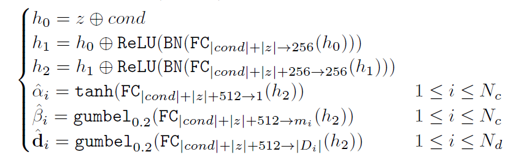
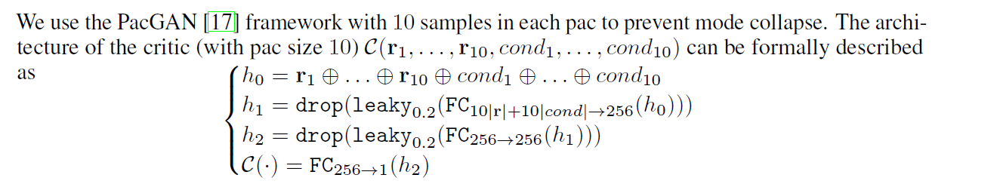
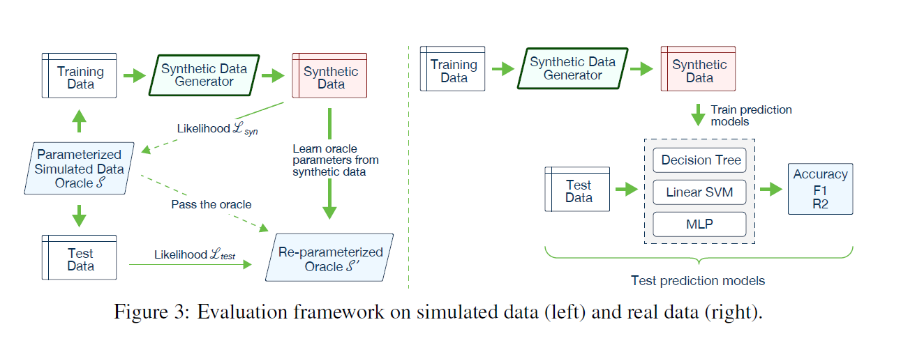

# Modeling Tabular Data using Conditional GAN

This paper introduces challenges with synthetic tabular data generation and addresses them. 
Specifically, they propose a conditional tabular GAN (**CTGAN**), which introduces several new techniques. The main contributions are as follow:

- Conditional GANs for synthetic data generation
- A benchmarking system for synthetic data generation algorithms

Some challenges noted are:
- Mixed data types
- Non-Gaussian distributions
- Multimodal distributions
- Learning from sparse one-hot-encoded vectors
- Highly imbalanced categorical columns

## CTGAN model

### Mode-specific Normalization
Discrete values can be naturally be represented as one-hot vectors, while the representation of the continuous values with arbitrary distribution is non-trivial. Previous model normally use min-max normalization to normalize continuous values to \( [-1, 1]\). In this paper, they design a *mode-specifc normalization* to overcome  the Non-Gaussian and multimodal distribution.

They process each column independently. Each value is represented as a one-hot vector indicating the mode, and a scalar indicating the value within the mode. This method contains 3 steps:

1. For each continuous column \(C_i\), use variational Gaussian mixture model (**VGM**) to estimate the number of modes \(m_i\) and fit a Gaussian mixture.
2. For each value \(c_i,_j\) in \(C_i\), compute the propability of \(c_i,_j\) coming from each mode.
3. Sample one mode from given the propability density, and use the sampled mode to normalize the value.

The representation of a row becomes the concatenation of continuous and discrete columns where the discrete value is one-hot representation.

### Conditional Generator and Training-by-Sampling
They design a *conditional generator and training-by-sampling* to deal with the imbalanced discrete columns.

In this method, since the training of the generator does not account for the imbalance in the categorical columns, they aim to resample efficiently in a way that all categories from discrete attributes are sampled evenly during the training process and to recover the real data distribution during test. This solution consists of 3 key elements, the *conditional vector*, the *generator loss*, and *the training-by-sampling* method.

### Network architecture

**Generator**:

**Discriminator**:

## Benchmarking Synthetic Data Generation Algorithms

They have 6 simulated datasets and 8 real datasets.

Simulated data come from a known probability distribution and for them we can evaluate the generated synthetic data via *likelihood fitness metric*. For real datasets, there is a ML task and we evaluate synthetic data generation method via *machine learning efficacy*.

